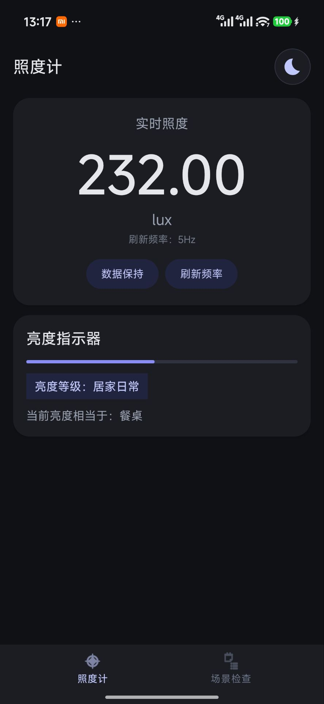
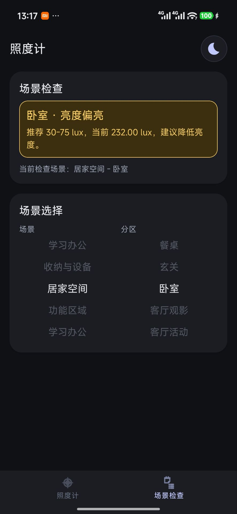

# Lux 照度计

通过手机光线传感器读取环境照度（**lux**），在屏幕中央大字显示当前数值，**保留两位小数**；显示刷新间隔可在 **200ms、500ms、1s、2s** 四档中切换（对应约 **5Hz / 2Hz / 1Hz / 0.5Hz**，默认 **500ms**），选择会持久保存。

## 实机截图

| 照度计（实时测量） | 场景检查（推荐范围对比） |
|:---:|:---:|
|  |  |

## 功能说明

### 照度计

- **实时照度**：大字显示当前 lux，便于站立或手持时一眼读数。  
- **刷新频率**：点按可在四档间隔间循环切换，界面显示等效 **Hz**（例如 200ms 对应约 **5Hz**），满足「想更跟手」与「想更省电、少跳动」两种需求。  
- **数据保持**：开启后冻结当前用于显示的数值，便于对照纸上标准或向他人展示某一时刻的读数。  
- **亮度指示器**：对数刻度的进度条，概括当前光强在常见室内～户外范围内的相对位置。  
- **亮度等级文案**：将当前照度归类为「夜晚微光」「居家日常」「办公级亮度」等可读描述。  
- **等效场景提示**：根据照度猜测与何种典型场景（如餐桌、办公）接近，辅助理解数值含义。  
- **明暗主题**：支持浅色 / 深色界面，与系统或应用内切换习惯一致。

### 场景检查

- **场景与分区**：按「居家空间、功能区域、学习办公、收纳与设备」等大类，再选具体分区（如卧室、厨房、书房阅读）。  
- **推荐照度区间**：每个场景带有 **min–max lux** 参考范围（内置为常见室内用途的经验区间，非强制标准）。  
- **即时判定**：将当前实测照度与所选场景对比，提示 **偏暗 / 合适 / 偏亮**，并给出「建议提高亮度」或「建议降低亮度」等文字说明。  
- **滚轮选择**：大类与分区双滚轮，滚动时有轻微触感反馈，选中项高亮。

### 通用

- 使用 `Sensor.TYPE_LIGHT`，**无需额外权限**即可在常见机型上读取光线传感器（需 **真机**；模拟器通常无光线传感器）。  
- 底部导航在「照度计」与「场景检查」之间切换；上次停留的 Tab 等偏好会记忆。

## 适用场景

- **家庭与租房**：检查客厅、卧室、书桌、餐桌附近照度是否过暗（易疲劳）或过亮（眩光），调整灯具位置与亮度。  
- **阅读与儿童学习**：大致对照「书房 / 儿童学习」等场景，判断是否需要台灯补光。  
- **老人起居**：在走廊、床头、卫生间门口等位置快速看数值，辅助改善夜间照明安全。  
- **摄影 / 摄像入门**：作为手机端简易照度参考（非专业测光表，但便于布光前后对比）。  
- **装修与买灯**：换灯前后在同一位置测 lux，用数据对比「有没有变亮」。  
- **传感器与设备体验**：开发或爱好者可用可调刷新率观察读数稳定性。

## 从 Git 克隆后

1. 用 **Android Studio** 打开本仓库根目录（与 `settings.gradle.kts` 同级）。  
2. 若根目录没有 `local.properties`：复制 `local.properties.example` 为 `local.properties`，将 `sdk.dir` 设为本机 Android SDK 路径；或在 Android Studio 中同步工程，IDE 常会代为创建。  
3. **不要**将含本机路径的 `local.properties` 提交到远程仓库（已在 `.gitignore` 中忽略）。  
4. 若 Gradle 报 JDK 问题，请在 **File → Settings → Build, Execution, Deployment → Build Tools → Gradle** 中指定 **JDK 17**，或在 `gradle.properties` 中按需设置 `org.gradle.java.home`（勿提交含隐私路径的注释块）。

## 环境要求

- Android Studio Ladybug (2024.2.1) 或更高版本（或兼容的 AGP 8.x）
- JDK 17
- Android SDK 34，minSdk 24

## 构建与运行

1. 用 **Android Studio** 打开项目目录 `LuxApp`。
2. 若提示缺少 Gradle Wrapper 或 `gradle-wrapper.jar`，使用菜单 **File → Sync Project with Gradle Files**；或在本机已安装 Gradle 时在项目根目录执行 `gradle wrapper` 生成。
3. 连接真机（光线传感器需真机）或选择模拟器，点击 **Run** 运行。

## 命令行构建

在项目根目录 `LuxApp` 下（需先有 `gradle-wrapper.jar`，用 Android Studio 同步或执行 `gradle wrapper` 生成）：

```bash
# 调试版 APK
./gradlew assembleDebug

# 输出：app/build/outputs/apk/debug/app-debug.apk
```

## 说明

- 使用 `Sensor.TYPE_LIGHT` 获取照度，单位 lux。  
- 场景推荐区间为应用内预设，仅供参考；专业验收请以相关国家标准或仪器检定为准。  
